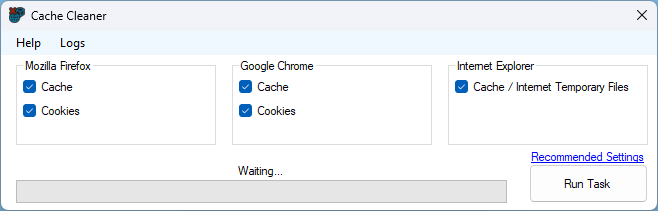
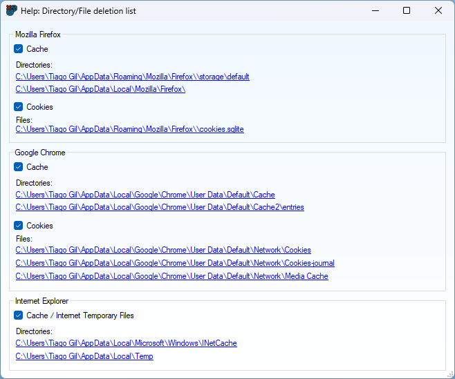

<!-- PROJECT LOGO -->
<br />
<div align="center">
  <a href="https://github.com/tiagoMDG/cache_cleaner">
    
  </a>

<h3 align="center">Cache Cleaner</h3>

  <p align="center">
    C# Browser cache cleaner for Firefox/Chrome/IE <br>(Also cleans temporary files)
</div>

<details>
  <summary>Table of Contents</summary>
  <ol>
    <li>
      <a href="#about-the-project">About The Project</a>
      <ul>
        <li><a href="#built-with">Built With</a></li>
      </ul>
    </li>
    <li>
      <a href="#getting-started">Getting Started</a>
      <ul>
        <li><a href="#prerequisites">Prerequisites</a></li>
        <li><a href="#installation">Installation</a></li>
      </ul>
    </li>
    <li><a href="#platform-usage">Platform Usage</a></li>
    <li><a href="#contact">Contact</a></li>
  </ol>
</details>

## About The Project

Cache Cleaner is a developed browser cache cleaning tool designed to automate and simplify the process of clearing cache, enhancing accessibility and improving workflow efficiency.

<p>I consider the project as a learning opportunity and my first dive into C# Desktop Development.

<p align="right">(<a href="#top">back to top</a>)</p>

### Built With

- [C#](https://learn.microsoft.com/en-us/dotnet/csharp/tour-of-csharp/)
- [Visual Studio](https://visualstudio.microsoft.com/)
- [Fody Costura](https://github.com/Fody/Costura)

<p align="right">(<a href="#top">back to top</a>)</p>

## Getting Started

### Prerequisites

- Visual Studio
- MySQL

### Installation

1. Clone the repo
   ```sh
   git clone https://github.com/TiagoMDG/cache_cleaner.git
   ```
2. Open the solution with Visual Studio `Cache_Cleaner.sln`

3. Install/Restore the required `Nugget Packages` if needed.

4. Change the build type to `Release` if you'd like and then build.

5. Binary is located in the following directory: `bin/Release`

<p align="right">(<a href="#top">back to top</a>)</p>

## App Usage

Comes with pre-configure `Recommended Settings`. (Basically clean everything.)



You can check the `Help` section for info on what is deleted depending on the selected settings.



It will also save logs on the files it deletes.

<p align="right">(<a href="#top">back to top</a>)</p>

## Contact

Tiago Gil - tiago.gil277@gmail.com

Project Link: [https://github.com/TiagoMDG/cache_cleaner](https://github.com/TiagoMDG/cache_cleaner)

<p align="right">(<a href="#top">back to top</a>)</p>
